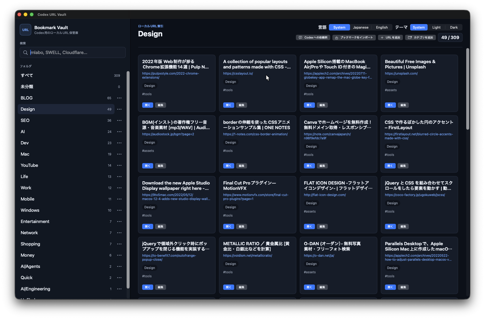
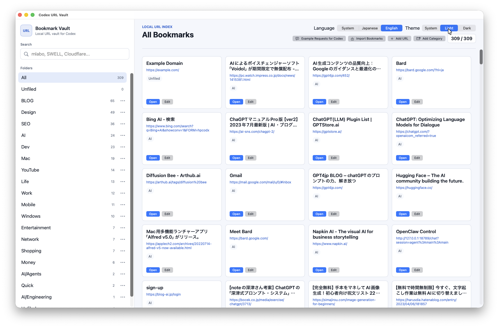

# Codex URL Vault Native

Local-first URL library for Codex, built as a native macOS app and Rust toolchain.

[日本語](#日本語) | [English](#english)

## Screenshots / スクリーンショット

### Dark / ダーク



### Light / ライト



---

## 日本語

### 概要

Codex URL Vault Native は、URL、カテゴリ、タグ、メモ、テキストスナップショットをローカルで管理する macOS 用 URL ライブラリです。SwiftUI アプリ、Rust CLI、Codex 向け MCP、Codex Browser/IAB Viewer、Brave 拡張機能が同じ Rust core と Vault データを共有します。

この `codex-url-vault-native` repository は独立した native project です。installable plugin の identity は `codex-url-vault` ですが、非 native 版 repository の checkout や Git 履歴を流用していません。

### 主な機能

- URL の検索、候補表示、追加、編集、移動、削除
- カテゴリ、タグ、メモの管理
- Chrome／Brave 互換 bookmark HTML の preview 付き import
- 保存済み UTF-8 text snapshot と checksum verification
- SwiftUI によるローカル URL browser/editor
- `System`／`Light`／`Dark` テーマ
- `System`／`日本語`／`English` 言語設定
- `System`／`Rounded`／`Serif`／`Monospaced` フォント設定
- `10–32 pt` の数値入力と1 pt単位の文字サイズ変更
- すべての表示設定の永続化
- Codex から利用できる task-oriented MCP tools
- Codex Browser/IAB 内で開く responsive card viewer
- Brave の現在の tab や選択 link を保存する Native Messaging 連携
- 音声やテキストによる「この URL を保存して」への対応

表示設定はアプリケーションメニューの `Settings…`（`⌘,`）および `表示` メニューから変更できます。メイン画面の言語・テーマ切り替えも同じ保存設定へ接続されています。

### 構成

| Component | 役割 |
| --- | --- |
| `url-vault-core` | SQLite schema、検索、bookmark HTML 互換、snapshot、locking、canonical export |
| `url-vault-cli` | machine-readable なローカル CLI |
| `url-vault-mcp` | Codex が利用する stdio MCP server |
| `url-vault-viewer` | token 付き ephemeral localhost IAB Viewer |
| `url-vault-ffi` | SwiftUI app から Rust core を呼び出す operation-specific C ABI |
| `Codex URL Vault.app` | native SwiftUI browser/editor |
| `url-vault-native-host` | Brave と Rust core を接続する Native Messaging Host |
| `extension/brave` | 現在の page／選択 link を保存する Brave extension |

すべての surface は `CODEX_URL_VAULT_HOME` が設定されている場合はその directory を使い、未設定時は `~/.codex/url-vault` を共有します。アプリ bundle には MCP server、CLI、Native Messaging Host が含まれます。

### 動作要件

- macOS 14 以降
- Swift 6.3 toolchain
- Rust toolchain（Cargo、Rust 2024 edition 対応）
- Codex CLI／Codex app（plugin を利用する場合）
- Brave（現在の page を保存する場合）
- Node.js（Brave extension validator を実行する場合のみ）

`app-shell-foundation` plugin は source の生成・更新に使用する maintenance tool であり、build dependency ではありません。生成済みの `AppShellFoundation.swift` は repository に含まれているため、通常の build に Codex plugin cache や個人環境の path は不要です。

### Build

```bash
git clone https://github.com/mlabo-org/codex-url-vault-native.git
cd codex-url-vault-native
./scripts/build-release.sh
```

生成物:

```text
dist/Codex URL Vault.app
```

build script は Rust release binaries、SwiftUI executable、app icon、Brave extension、生成済み Native Messaging manifest を1つの署名済み app bundle にまとめます。

### アプリのインストール

```bash
mkdir -p "$HOME/Applications"
ditto "dist/Codex URL Vault.app" "$HOME/Applications/Codex URL Vault.app"
open "$HOME/Applications/Codex URL Vault.app"
```

Codex plugin launcher の既定 app path は `$HOME/Applications/Codex URL Vault.app` です。別の場所へ install する場合だけ `CODEX_URL_VAULT_APP_PATH` に app bundle の absolute path を設定してください。

### Codex plugin のインストール

repository identity は `codex-url-vault-native`、installable plugin identity は `codex-url-vault` です。

```bash
codex plugin marketplace add mlabo-org/codex-url-vault-native --ref main
codex plugin add codex-url-vault@codex-url-vault-native-marketplace
```

plugin を呼び出す前に native app を build・install してください。plugin launcher は install 済み app 内の native MCP binary を起動するだけで、SQLite 処理や fallback implementation は持ちません。

Codex への依頼例:

```text
Codex URL Vault を開いて
Codex の中で URL Vault を表示して
保存済み URL から Cloudflare の資料を探して
この URL を Design カテゴリへ保存して
```

`show_vault` は独立した SwiftUI app を開きます。`show_iab_vault` は MCP process 内で random loopback port と session token を使う Viewer を開始し、Codex Browser/IAB 用 URL を返します。

### Brave extension と Native Messaging

1. native app を build して `$HOME/Applications/Codex URL Vault.app` に install します。
2. `brave://extensions` を開き、Developer mode で `extension/brave` を unpacked extension として読み込みます。
3. install 済み app の binary から、実際の absolute host path を含む manifest を生成します。
4. 同じ manifest を Brave の browser-wide／active-profile `NativeMessagingHosts` directory と、必要な Chromium compatibility lookup directory に登録します。
5. Brave を再起動します。extension source を更新した場合は unpacked extension を reload します。

manifest の生成例:

```bash
HOST="$HOME/Applications/Codex URL Vault.app/Contents/Resources/url-vault-native-host"
"$HOST" --print-brave-manifest "$HOST" > /tmp/com.suzukimakoto.codex_url_vault.json
```

tracked file の `extension/native-host/com.suzukimakoto.codex_url_vault.json` は portable template です。placeholder を含む template をそのまま runtime location に登録しないでください。

extension ID は `fhijpanhohijhimeiajdgfhcpipbhkkh` です。popup は active tab の URL と title を読み込み、カテゴリ、タグ、メモとともに保存できます。context menu は現在の page または選択 link を保存します。

`save_current_brave_page` は user-only Unix socket と Native Messaging Host を経由し、foreground Brave window の active tab から URL と title を取得します。`http`／`https` 以外、tab の変更、bridge 切断時には推測や別 route への fallback を行わず error を返します。

### データと portability

- 既定 Vault: `~/.codex/url-vault`
- override: `CODEX_URL_VAULT_HOME`
- 既定 app: `$HOME/Applications/Codex URL Vault.app`
- app override: `CODEX_URL_VAULT_APP_PATH`
- shipped source に特定ユーザーの home absolute path は含めません
- Native Messaging manifest の absolute host path は install 時に生成します
- SQLite、snapshot、socket、`target/`、`dist/`、`macos/.build/` は runtime／generated artifacts です

### 開発時の確認

Rust workspace:

```bash
cargo test --workspace
```

Brave extension／manifest contract:

```bash
node scripts/validate-brave-extension.mjs
```

Runnable macOS app:

```bash
./scripts/build-release.sh
```

build、validation、Git commit、GitHub push、plugin refresh、app installation、Brave extension loading、Native Messaging registration、runtime activation はそれぞれ独立した operation です。この repository は後段を暗黙には実行しません。

---

## English

### Overview

Codex URL Vault Native is a local-first URL library for macOS. It stores URLs, categories, tags, notes, and text snapshots. The SwiftUI app, Rust CLI, Codex MCP server, Codex Browser/IAB Viewer, and Brave extension share the same Rust core and Vault data.

This `codex-url-vault-native` repository is an independent native project. Its installable plugin identity is `codex-url-vault`; it is not a replacement checkout or Git-history continuation of the non-native repository.

### Features

- Search, suggest, add, edit, move, and delete saved URLs
- Manage categories, tags, and notes
- Preview and import Chrome/Brave-compatible bookmark HTML
- Preserve supplied UTF-8 text snapshots and verify their checksums
- Browse and edit the local Vault in a native SwiftUI app
- Choose `System`, `Light`, or `Dark` appearance
- Choose `System`, `Japanese`, or `English` language
- Choose `System`, `Rounded`, `Serif`, or `Monospaced` fonts
- Enter an exact font size from `10–32 pt` or change it in 1 pt steps
- Persist all display preferences
- Use task-oriented MCP tools from Codex
- Open a responsive card viewer inside Codex Browser/IAB
- Save the current Brave tab or a selected link through Native Messaging
- Handle voice- or text-driven “save this URL” requests

Display preferences are available from the application `Settings…` command (`⌘,`) and the `Display` menu. The language and theme controls in the main window use the same persisted settings.

### Architecture

| Component | Responsibility |
| --- | --- |
| `url-vault-core` | SQLite schema, search, bookmark HTML compatibility, snapshots, locking, and canonical export |
| `url-vault-cli` | Machine-readable local CLI |
| `url-vault-mcp` | Task-oriented stdio MCP server for Codex |
| `url-vault-viewer` | Token-protected ephemeral localhost IAB Viewer |
| `url-vault-ffi` | Operation-specific C ABI used by the SwiftUI app |
| `Codex URL Vault.app` | Native SwiftUI browser/editor |
| `url-vault-native-host` | Native Messaging bridge between Brave and the Rust core |
| `extension/brave` | Brave extension for saving the current page or a selected link |

Every surface uses `CODEX_URL_VAULT_HOME` when set and otherwise shares `~/.codex/url-vault`. The app bundle includes the MCP server, CLI, and Native Messaging Host.

### Requirements

- macOS 14 or later
- Swift 6.3 toolchain
- Rust toolchain with Cargo and Rust 2024 edition support
- Codex CLI or Codex app when using the plugin
- Brave when using current-page capture
- Node.js only when running the Brave extension validator

The `app-shell-foundation` plugin is a maintenance tool used to generate or update source; it is not a build dependency. The generated `AppShellFoundation.swift` is committed to this repository, so a normal build does not require a Codex plugin cache or a user-specific path.

### Build

```bash
git clone https://github.com/mlabo-org/codex-url-vault-native.git
cd codex-url-vault-native
./scripts/build-release.sh
```

Output:

```text
dist/Codex URL Vault.app
```

The build script assembles the Rust release binaries, SwiftUI executable, app icon, Brave extension, and generated Native Messaging manifest into one signed app bundle.

### Install the app

```bash
mkdir -p "$HOME/Applications"
ditto "dist/Codex URL Vault.app" "$HOME/Applications/Codex URL Vault.app"
open "$HOME/Applications/Codex URL Vault.app"
```

The Codex plugin launcher resolves `$HOME/Applications/Codex URL Vault.app` by default. Set `CODEX_URL_VAULT_APP_PATH` to an absolute app-bundle path only when installing elsewhere.

### Install the Codex plugin

The repository identity is `codex-url-vault-native`; the installable plugin identity is `codex-url-vault`.

```bash
codex plugin marketplace add mlabo-org/codex-url-vault-native --ref main
codex plugin add codex-url-vault@codex-url-vault-native-marketplace
```

Build and install the native app before invoking the plugin. The plugin launcher only starts the native MCP binary inside the installed app; it does not implement Vault operations, SQLite access, or a fallback backend.

Example requests:

```text
Open Codex URL Vault.
Show the URL Vault inside Codex.
Find my saved Cloudflare references.
Save this URL in the Design category.
```

`show_vault` opens the independent SwiftUI app. `show_iab_vault` starts or reuses a Viewer inside the MCP process, using a random loopback port and session token, and returns a URL for Codex Browser/IAB.

### Brave extension and Native Messaging

1. Build the native app and install it at `$HOME/Applications/Codex URL Vault.app`.
2. Open `brave://extensions`, enable Developer mode, and load `extension/brave` as an unpacked extension.
3. Generate a manifest from the installed native-host binary so it contains the real absolute host path.
4. Register the same manifest in Brave's browser-wide and active-profile `NativeMessagingHosts` directories and, where required, its Chromium compatibility lookup directory.
5. Restart Brave. Reload the unpacked extension after extension source changes.

Manifest generation example:

```bash
HOST="$HOME/Applications/Codex URL Vault.app/Contents/Resources/url-vault-native-host"
"$HOST" --print-brave-manifest "$HOST" > /tmp/com.suzukimakoto.codex_url_vault.json
```

The tracked `extension/native-host/com.suzukimakoto.codex_url_vault.json` is a portable template. Do not register the placeholder-bearing source template unchanged.

The stable extension ID is `fhijpanhohijhimeiajdgfhcpipbhkkh`. The popup reads the active tab URL and title and saves them with an optional category, tags, and note. The context menu saves the current page or a selected link.

`save_current_brave_page` obtains the URL and title from the active tab in the foreground Brave window through a user-only Unix socket and the Native Messaging Host. Non-`http`/`https` pages, changed tabs, and disconnected bridges return an error without URL inference or fallback capture.

### Data and portability

- Default Vault: `~/.codex/url-vault`
- Vault override: `CODEX_URL_VAULT_HOME`
- Default app: `$HOME/Applications/Codex URL Vault.app`
- App override: `CODEX_URL_VAULT_APP_PATH`
- Shipped source contains no fixed absolute path to a specific user's home directory
- The absolute Native Messaging host path is generated at installation time
- SQLite data, snapshots, sockets, `target/`, `dist/`, and `macos/.build/` are runtime or generated artifacts

### Development checks

Rust workspace:

```bash
cargo test --workspace
```

Brave extension and manifest contract:

```bash
node scripts/validate-brave-extension.mjs
```

Runnable macOS app:

```bash
./scripts/build-release.sh
```

Build, validation, Git commit, GitHub push, plugin refresh, app installation, Brave extension loading, Native Messaging registration, and runtime activation are separate operations. This repository does not perform later operational stages implicitly.

---

## License

[MIT](LICENSE)
